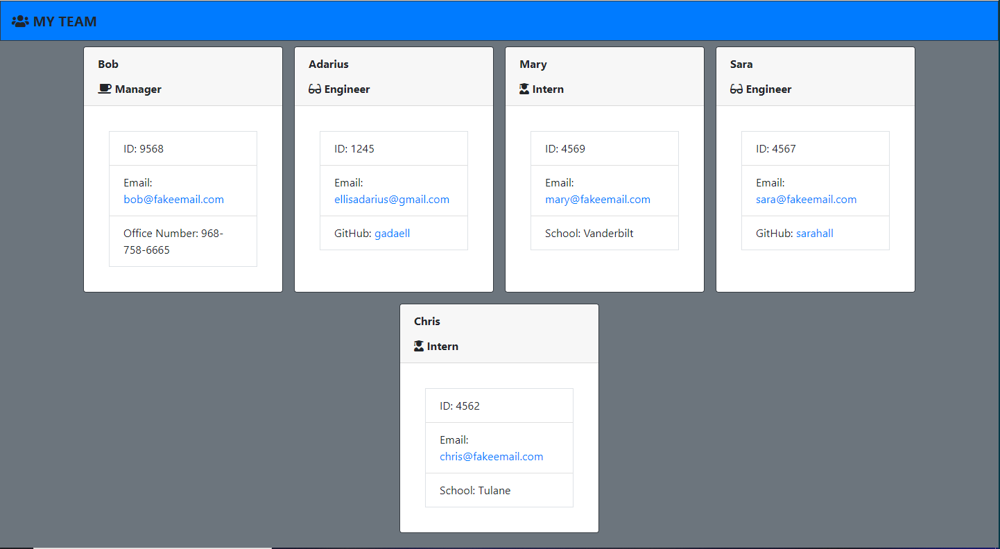

# Team-Profile-Gen

## User Story

- AS A manager
  I WANT to generate a webpage that displays my team's basic info
  SO THAT I have quick access to their emails and GitHub profiles

## Acceptance Criteria

### GIVEN a command-line application that accepts user input

- WHEN I am prompted for my team members and their information
  THEN an HTML file is generated that displays a nicely formatted team roster based on user input
- WHEN I click on an email address in the HTML
  THEN my default email program opens and populates the TO field of the email with the address
- WHEN I click on the GitHub username
  THEN that GitHub profile opens in a new tab
- WHEN I start the application
  THEN I am prompted to enter the team manager’s name, employee ID, email address, and office number
- WHEN I enter the team manager’s name, employee ID, email address, and office number
  THEN I am presented with a menu with the option to add an engineer or an intern or to finish building my team
- WHEN I select the engineer option
  THEN I am prompted to enter the engineer’s name, ID, email, and GitHub username, and I am taken back to the menu
- WHEN I select the intern option
  THEN I am prompted to enter the intern’s name, ID, email, and school, and I am taken back to the menu
- WHEN I decide to finish building my team
  THEN I exit the application, and the HTML is generated

# Purpose

To generate a webpage that displays a team's basic info with access to their emails and github accounts.

## Built with

- HTML
- CSS
- JavaScript
- Node, Inquirer & Jest

## Challenges

- Wasn't able to figure out how to apply the startingPrompt() to incorporate the change of the title and header.

- Creating the template was the hardest part

## Website

- https://github.com/gadaell/Team-Profile-Gen

- Instuction video link: https://drive.google.com/file/d/1lvBTdhzJQGM6ViF9uo7U0xCTMIJ8rZ6Z/view

## Installation/Usage

- Install VS Code.
- Clone this Repository: https://github.com/gadaell/Professional-ReadMe-Gen
- Download inquirer; npm install inquirer & Jest; npm install --save-dev jest
- Run this command: "node index.js"
- Answer the Questions
- Once you are done navigate to the "Output" Sub-Folder and your new Create-Team html will be there!

## Contribution

Made by A'Darius (A'D) Ellis

### ©️2021 Team-Profile-Generator
